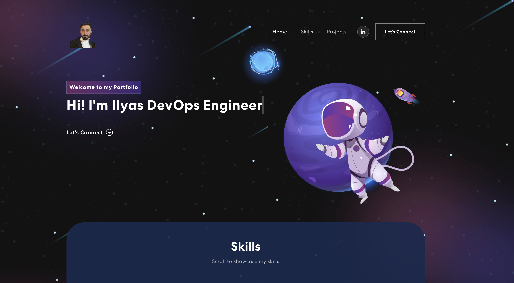

# DevOps Engineering Portfolio Website

Welcome to my DevOps Engineering portfolio website repository! This website showcases my skills, experience, and projects in the field of DevOps Engineering.

## About

This portfolio website is built using React for the front-end, with styling done using React-bootstrap. CSS animations are incorporated using Animate.css.

## Usage

To view the website locally:
1. Clone this repository.
2. Install dependencies using `npm install`.
3. Start the development server using `npm start`.
4. Open your browser and navigate to `http://localhost:3000`.

## Features

- Clean and responsive user interface.
- Sections for showcasing skills, experience, and projects.
- Contact section with email and LinkedIn links for reaching out.

## Technologies Used

- Front-end library: React
- CSS framework: React-bootstrap
- CSS animations library: Animate.css

## Deployment

The website is deployed using [GitHub Pages](https://pages.github.com/), making it accessible to anyone.
